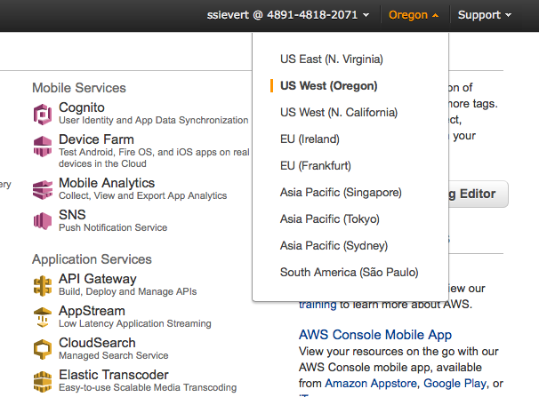

.. include:: links.rst
.. _setup:

==========
Setup
==========

*If not familiar with the command line, visit a* `command line tutorial`_.

*If you're running into bugs while setting up, look at* `troubleshooting`_.

Complete setup guides
----------------------
... can be found on the `GitHub wiki`_.

.. _`GitHub wiki`: https://github.com/kgjamieson/NEXT/wiki

Quick setup script
------------------
This will provide

* an easy-to-type command, ``next_ec2`` that is aliased to *part* of a longer
  command.
* Variables for your AWS access keys and other Amazon credentials.

.. code-block:: shell

    # FILE : ~/Desktop/next_setup.sh. Can be run with `source ~/Desktop/next_setup.sh`
    cd /path/to/NEXT
    # if no IAM user: AWS > Identity and Access Management > Users > Add User
    # if IAM user: AWS > IAM > Users > select username > User Actions > Manage Access Keys > Create Access Key > Download credentials
    # more details found at [1]
    # [1]:http://docs.aws.amazon.com/AWSSimpleQueueService/latest/SQSGettingStartedGuide/AWSCredentials.html
    export AWS_ACCESS_KEY_ID=<access>
    export AWS_SECRET_ACCESS_KEY=<secret>

    # Create a new key in AWS > EC2 > Key Pairs > Create Key Pair
    # KEY_FILE is the path to the downloaded file
    # KEY_PAIR is the name entered in Amazon of the key
    # (i.e, if "key" created, KEY_PAIR="key" not "key.pem")
    export KEY_FILE=/Users/scott/Classes/security/AWS/SS_NEXT.pem
    export KEY_PAIR=SS_NEXT
    chmod 400 $KEY_FILE

    # This might be a useful alias
    alias next_ec2='python next_ec2.py --key-pair=$KEY_PAIR --identity-file=$KEY_FILE'

    # Launching a bucket into S3. Either run the command below or define AWS_BUCKET_NAME
    #python next_ec2.py --key-pair=$KEY_PAIR --identity-file=$KEY_FILE createbucket SS_next
    export AWS_BUCKET_NAME=<bucket uiud>

    # launch the instance (we don't because it's a setup script)
    #python next_ec2.py --key-pair=$KEY_PAIR --identity-file=$KEY_FILE launch SS_next

    # after `next_ec2 launch cluster_name` and it eventually prints
    # out red and green `rabbitmqmonitor_1`...
    # if launching GUI or NEXT-psych, go to [2]
    # if launching CLI or NEXT      , go to [3]
    #
    # (these URLs are for NEXT 0.1)
    # [2]:http://<ec2-public-dns>
    # [3]:http://<ec2-public-dns>:8000/dashboard/experiment_list

.. todo:: Clean up the startup scripts so the output makes sense. Maybe include green highlighted lines that say "[notice] Your NEXT server is running at <ec2-public-dns>." This could be viewable with ``docker-compose logs notice`` on the remote machine.

.. _`command line tutorial`: http://blog.teamtreehouse.com/introduction-to-the-mac-os-x-command-line

.. _troubleshooting:

Troubleshooting
-----------------
While looking at the below troubleshooting hints, look at the output your script
gives you, towards the end. The keywords you're looking for will probably be in
the last couple lines.

I get errors like ``InvalidKeyPair.NotFound`` while trying to launch my cluster
^^^^^^^^^^^^^^^^^^^^^^^^^^^^^^^^^^^^^^^^^^^^^^^^^^^^^^^^^^^^^^^^^^^^^^^^^^^^^^^^^^^^

`Solution`: Change your AWS default region to Oregon. The image below shows how.

This is documented on GitHub with `NEXT issue #11`_.

.. _`NEXT issue #11`: https://github.com/kgjamieson/NEXT/issues/11

The ``next_ec2.py`` script defines a default region. The AWS EC2 keys are only
in one region and are not global; this means that ``--identity-file`` and
``--key-pair`` can't find what they're looking for.

.. todo:: Allow NEXT use in any region, not just Oregon.

I get errors with Python's ``print`` statement
^^^^^^^^^^^^^^^^^^^^^^^^^^^^^^^^^^^^^^^^^^^^^^
Errors such as ``SyntaxError: Missing parentheses in call to 'print'``

`Solution`: Activate a `virtualenv`_ for Python 2 (I would go with Python 2.7).

To do that, you can either use ``virtualenv`` or ``conda`` (but only if you use
the `Anaconda`_ Python distro.

.. code-block:: shell

    # if using Anaconda. Can be run from anywhere
    create --name py26 python=2.6 anaconda

    # setup if using virtual env
    mkdir env      # making the environment folder
    virtualenv env # activating the virtualenv

    # virtualenv activation. Must have the path to `activate`
    source env/bin/activate

    # get rid of virtualenv (applies to both conda and virtualenv)
    source deactivate

.. _`virtualenv`: http://virtualenv.readthedocs.org/en/latest/
.. _`Anaconda`: https://store.continuum.io/cshop/anaconda/
